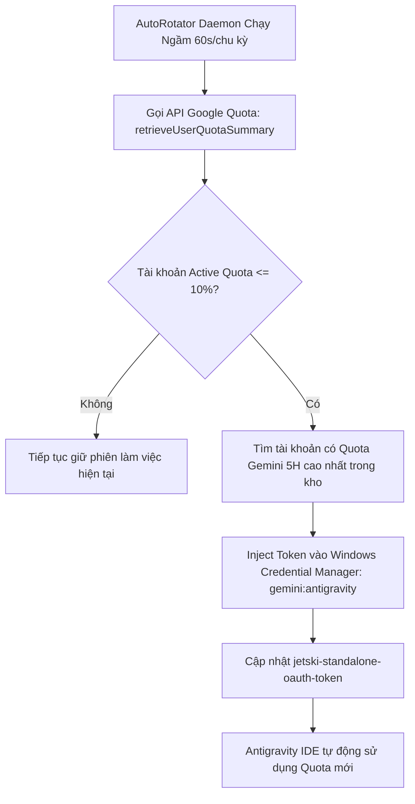

# ⚡ Antigravity Auto-Rotation Hub (Auto-Pilot Multi-Account Quota Manager)

<p align="center">
  
  
  
  
</p>

Hệ thống quản lý đa tài khoản Google và **tự động xoay tua hạn mức (Quota Auto-Pilot) 100% ngầm** dành riêng cho **Antigravity IDE** trên Windows.

---

## 🌟 Tính Năng Nổi Bật

* 🚀 **Tích hợp trực tiếp Antigravity IDE (Không cần mở nhiều Profile/Window):** Hoạt động ngay trên cửa sổ Antigravity IDE hiện tại của bạn.
* 🤖 **Auto-Pilot Quota Watcher (Chạy ngầm 24/7):** Tiến trình daemon ngầm tự động quét và đo hạn mức **Gemini 5H Quota** thời gian thực của toàn bộ tài khoản trong kho. Khi tài khoản active chạm ngưỡng $\le 10\%$, hệ thống tự động hoán đổi sang tài khoản còn nhiều Quota nhất mà không làm gián đoạn công việc.
* 🔐 **Tích hợp Native Windows Credential Manager:** Đọc & nạp Token trực tiếp qua API bảo mật `advapi32.dll` (`gemini:antigravity`), tự động nhận diện Email Google khi đăng nhập.
* 📦 **1-Click Portable Setup:** Chỉ cần clone repo về bất kỳ thư mục nào trên máy mới và chạy `Setup-Install.bat`, hệ thống tự tạo Shortcut Desktop và kích hoạt Service khởi động cùng Windows.
* 🎨 **Giao diện WPF Dark Mode Hiện đại & Chuẩn Quốc Tế:** Giao diện trực quan, hỗ trợ theo dõi tiến trình Quota từng tài khoản, 100% chuẩn mã hóa Unicode không bao giờ lỗi font chữ.
* 🛡️ **Bảo mật Tuyệt đối:** Toàn bộ OAuth tokens và thông tin tài khoản được lưu cục bộ trên máy bạn và được cấu hình `.gitignore` loại trừ triệt để, không bao giờ bị đẩy lên GitHub.

---

## 📂 Cấu Trúc Dự Án (Project Architecture)

```text
Antigravity-Auto-Hub/
├── accounts/                  # Thư mục lưu token các tài khoản Google (Được bảo vệ bởi .gitignore)
├── MainWindow.xaml            # Giao diện WPF Dark Mode (Chuẩn XML Entity Unicode)
├── AntigravityHub.ps1         # Bảng điều khiển quản trị tài khoản & Quota Dashboard
├── AutoRotator.ps1            # Engine theo dõi Quota thời gian thực & Auto-Rotation ngầm
├── launch-switcher.vbs        # VBScript khởi chạy giao diện hoàn toàn ẩn
├── Chuyen-Doi-Tai-Khoan.bat   # Phím tắt mở Hub nhanh
├── Setup-Install.bat          # Kịch bản cài đặt 1-Click cho máy mới
├── Setup.ps1                  # Trình thiết lập Shortcut & Startup Service
├── .gitignore                 # Chặn rò rỉ token OAuth & logs
└── README.md                  # Hướng dẫn sử dụng chi tiết
```

---

## 🚀 Hướng Dẫn Cài Đặt & Sử Dụng Trên Máy Mới

### 1. Clone Kho Mã Nguồn
```powershell
git clone https://github.com/datdtpl-maker/Antigravity-Auto-Hub.git
cd Antigravity-Auto-Hub
```

### 2. Cài Đặt 1-Click
* Nhấp đúp chuột vào file **`Setup-Install.bat`**.
* Hệ thống sẽ tự động:
  1. Tạo phím tắt **`Antigravity Auto-Hub`** ngoài màn hình Desktop.
  2. Đăng ký Service ngầm **`AutoRotator.ps1`** vào thư mục Windows Startup để tự khởi động cùng máy.
  3. Mở ngay giao diện điều khiển.

---

## 💡 Cách Thêm Tài Khoản Google Vào Kho Xoay Tua

1. Mở **`Antigravity Auto-Hub`** ngoài Desktop $\rightarrow$ Bấm **`+ Thêm Tài Khoản Mới`**.
2. Quay lại Antigravity IDE $\rightarrow$ Tiến hành Đăng nhập tài khoản Google mới.
3. Đăng nhập xong trên IDE $\rightarrow$ Mở lại Hub và bấm **`Lưu Acc Này`**.
4. Hệ thống sẽ tự động nhận diện Email Google và nạp vào danh sách xoay tua!

---

## ⚙️ Cơ Chế Tự Động Xoay Tua (Auto-Pilot Logic)



---

## 🔒 Bảo Mật & Quyền Riêng Tư

* Dự án **KHÔNG** gửi bất kỳ dữ liệu hay Token nào về máy chủ bên thứ ba. Toàn bộ Token chỉ giao tiếp trực tiếp với máy chủ chính thức của Google (`oauth2.googleapis.com` & `cloudcode-pa.googleapis.com`).
* File `.gitignore` đã loại trừ toàn bộ thư mục `accounts/*.json`, `current_active.txt` và `*.log`. Bạn có thể yên tâm chia sẻ hoặc commit mã nguồn lên GitHub công khai.

---

## 📄 Bản Quyền
Phát hành theo giấy phép [MIT License](LICENSE).
